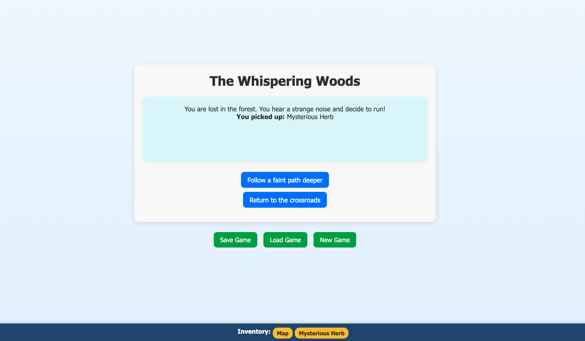

# CFML Adventure Game

A minimal text-based adventure game built with **CFML**.  
Players can explore scenes, collect items, and save or load progress using a REST-style API.

---

## 🚀 Features
- Scene-based storytelling powered by `story.json`
- Inventory system stored in session
- Save, load, and reset game state through a simple API
- Clean CFML structure using components and scripts

---

## 🧩 Project Structure
components/  
└── Game.cfc  
api/  
└── state.cfm  
adventure.cfm  
story.json  
application.cfc  
css/  
└── styles.css  

---

## ▶️ How to Run

### 🖥️ Run Locally with Docker
Run:
`docker-compose up --build`

Then visit:  
**http://localhost:8888/index.cfm**
or
**http://localhost:8888/adventure.cfm**

---

## 🧠 Technical Notes
- Session-based state management (`session.gameState`)
- REST-like API in `/api/state.cfm` handles:
  - **GET** → Load saved game  
  - **POST** → Save game  
  - **DELETE** → Start a new game
- Story content is loaded from `story.json` via `components/Game.cfc`
